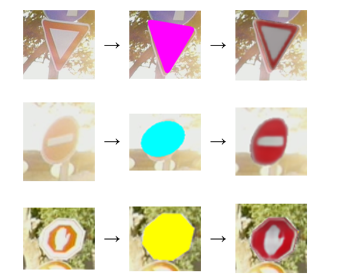
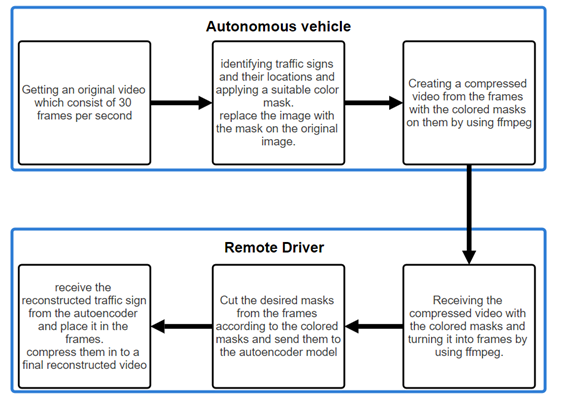
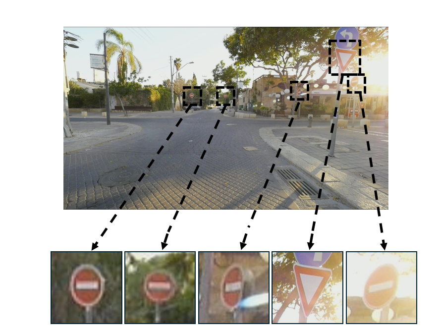
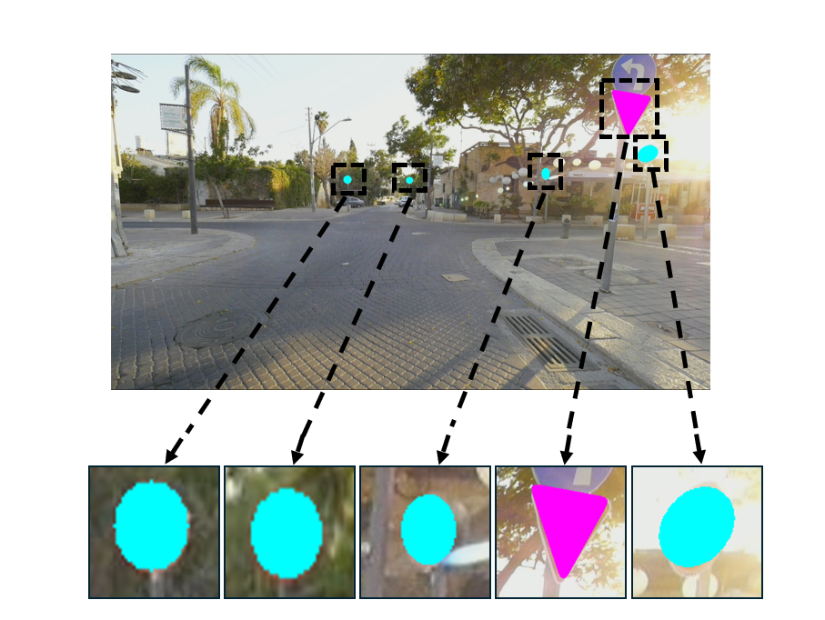
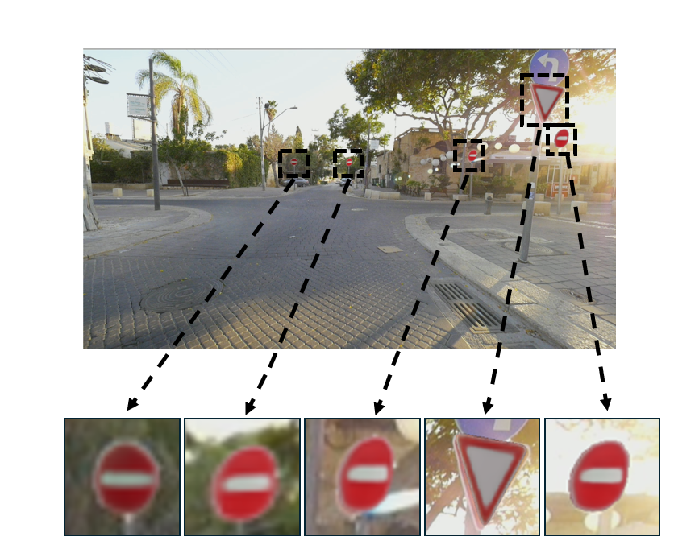
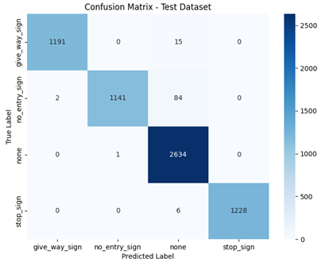
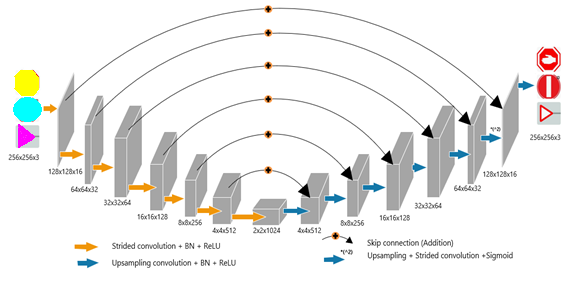
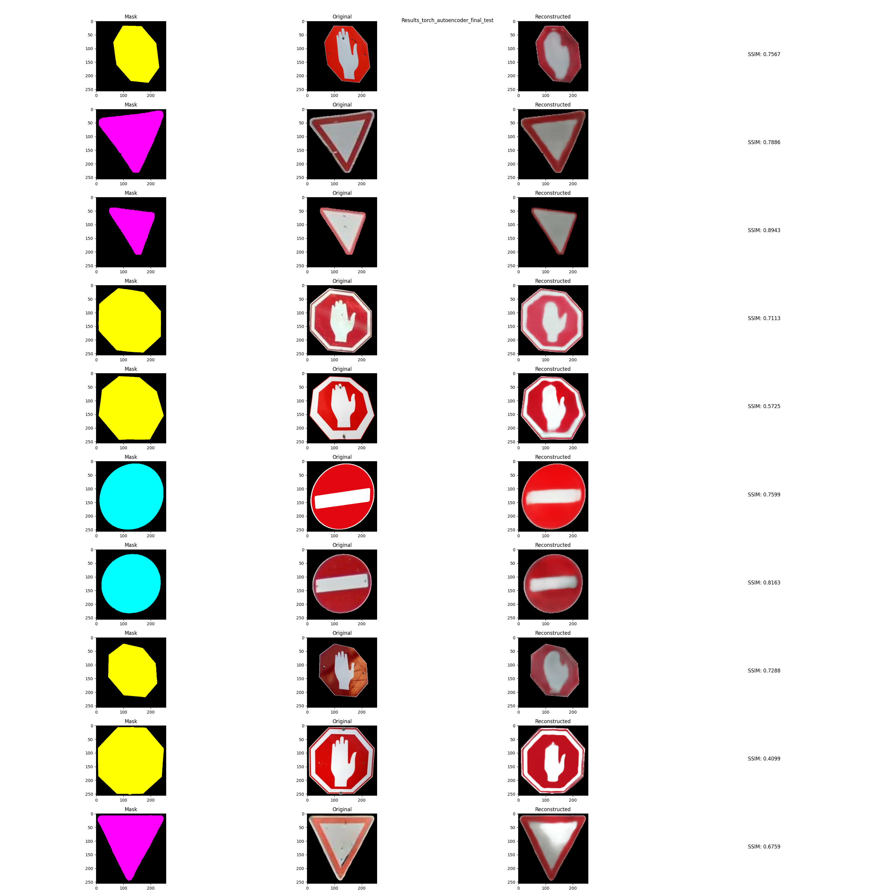

# DL Traffic Signs Overlays by Artificial Data Set

This project focuses on improving traffic sign recognition for autonomous vehicles, particularly under challenging conditions. It aims to enhance video quality and minimize bandwidth usage for remote driving by developing an algorithm that generates colored masks for traffic signs. A trained autoencoder model reconstructs these signs from their corresponding masks, addressing issues like varying angles, distances, and visibility impairments such as glare or vandalism. Our approach utilizes a database of real-world images to train the model, ensuring robustness in diverse driving scenarios.



*Figure 1: Example of the system on our traffic sign*

## Project Goals
Real-World Application: Ensure effective recognition and reconstruction of traffic signs in unpredictable environments, prioritizing visual clarity.
Diverse Sign Recognition: Train the system to handle a wide range of road signs, aiming for low reconstruction loss and high similarity (SSIM) between original and reconstructed images.
Robustness to Visibility Conditions: Develop the system to function reliably under various visibility challenges, including adverse weather and lighting.
Demonstration Videos: Create two videos: one showcasing colored masks in place of traffic signs and another demonstrating the autoencoder's reconstruction process.

## Purpose
The project aims to improve traffic sign visibility on a remote driver's screen by classifying signs into color-coded masks. This method enhances clarity while optimizing bandwidth by transmitting simplified mask data instead of high-resolution images, making it suitable for real-world applications.


# System Definition
The project consists of two main components:

- Vehicle Side: A video capture and mask creation system, which processes and compresses traffic sign data for transmission.
- Remote Driver Side: A video receiving and traffic sign reconstruction system, where the signs are identified from the masks and restored to a high clarity suitable for remote driving.
  


*Figure 2: system block diagram*


## Process Details




*Figure 3: Pre-Processing Real-time image*

Vehicle Side:
- Video Capture: Receives continuous video from the vehicle's camera.
- Frame Extraction: Extracts individual frames for processing.
- Traffic Sign Detection and Mask Creation: Identifies traffic signs in each frame using YOLO, classifies into three main types: Stop, Give Way, and No Entry then overlays color-coded masks (e.g., yellow for "stop" signs) on the frames.
- Video with Masks Creation: Compiles the processed frames with masks back into a video format for efficient transmission to the remote driver.



*Figure 4: Image with the colored mask*
 
Remote Driver Side:
- Receiving and Frame Extraction: Processes the masked video frames.
- Traffic Sign Reconstruction with Autoencoder: Each traffic sign mask is passed through a trained autoencoder, which reconstructs the sign based on learned features from the training set.
- Video Compilation with Restored Signs: Combines the reconstructed frames into a video, enhancing sign visibility and clarity for the remote driver.

  


*Figure 5: Reconstruct image after the autoencoder*

## Models Created
Traffic Sign Classification Model:
- Data Collection: Images of real-world traffic signs were curated and categorized into foure main types: Stop, Give Way, No Entry and other (that cointain all other traffic signs). Additional images were sourced and augmented to increase robustness under various conditions.
- Model Architecture: A CNN was designed and trained on these labeled images, achieving high accuracy in classifying traffic signs. The model demonstrates strong performance in identifying and classifying signs from a distance and under adverse conditions.
- Training Process: The model was trained with the Adam optimizer, using a learning rate of 0.0001 and Cross-Entropy Loss to handle classification tasks. Training was conducted over 20 epochs with early stopping to prevent overfitting. The final model demonstrated a high level of accuracy (98.3%) across all classes, as verified by a confusion matrix and metrics like accuracy, precision, recall, and F1-score.



*Figure 6: Confusin matrix of classification model*


Autoencoder Model:
- Purpose: The autoencoder reconstructs traffic signs from the color-coded masks generated on the vehicle side.
- Architecture: The autoencoder includes an encoder to compress masked input into a latent representation and a decoder to reconstruct the image. Skip connections between corresponding encoder and decoder layers ensure that spatial details from the original image are retained, improving reconstruction quality.
- Training Process: The model was trained with L1 and MSE loss functions, with high SSIM scores indicating successful reconstruction of the signs in varied conditions.



*Figure 7: Visualization of Autoencoder architecture*



*Figure 8: Results autoencoder model*

## System Results
The project includes two demonstration videos:

- Mask Overlay Video: Displays the vehicle's processed view with masked signs.
- Reconstructed Sign Video: Shows the remote driver’s view with fully reconstructed signs.


Based on the code you’ve shared from `main.py`, here are some observations and necessary adjustments for the instructions:

1. **Directory Setup**:
   - The code references paths like `traffic_sign_overlays`, `finel_project_github/videos`, `finel_project_github/pytorch_multi_classification_11_09.pth`, and `finel_project_github/torch_autoencoder_final.pth`.
   - Update the instructions to clarify these paths and where the `.pth` files should be placed.

2. **Dependencies**:
   - Make sure dependencies like `functions.py`, `video_with_mask.py`, and `reconstruct_video.py` are in the `traffic_sign_overlays` folder, as these files are imported directly in the code.


# Instructions for Running the Code

1. **Create a Project Directory**:
   - Begin by creating a folder named traffic_sign_overlays in your preferred location on your computer. This will be the main directory for all required files and models.

     ```bash
     mkdir -p traffic_sign_overlays
     ```

2. **Download and Place Required Files**:
   - Download the following files from the [Google Drive link](https://drive.google.com/drive/folders/1vNAXVxpBt1XPxGVO_tN7Ea5oo7bfWk4w?usp=drive_link):
     - `pytorch_multi_classification_11_09.pth`
     - `torch_autoencoder_final_2024.pth`
     - `videos`
   - Move these downloaded files into the traffic_sign_overlays folder.
   - The 'videos' folder contains a video called 'videofile_noentry.yuv' that will be used as an example.
   - You can add more videos in YUV format to this folder and change the line in the main.py file that says: video_name = 'videofile_noentry' to: video_name = 'your_video_name'

3. **Add Code Files**:
   - Place the following Python code files in the main `traffic_sign_overlays` folder:
     - `functions.py`
     - `main.py`
     - `models.py`
     - `reconstruct_video.py`
     - `torch_autoencoder_model.py`
     - `video_with_mask.py`

4. **Install Dependencies**:
   - Open a terminal and navigate to the `traffic_sign_overlays` directory:

     ```bash
     cd traffic_sign_overlays
     ```

5. **Run the Code**:
   - In the terminal, run the `main.py` script to execute the program. This script processes the input video, applies traffic sign masks, and reconstructs the signs.

     ```bash
     python main.py
     ```

6. **Output**:
   - The program will generate videos and processed frames, handling mask overlays and reconstructed traffic signs, which will be stored in the `finel_project_github/part1` and `finel_project_github/part2` folders coresponded to the two main components of the system.

